# Django 4.2 → 5.2 Migration Timeline

## 6-Month Migration Timeline with Decision Points


## Timeline Summary by Phase

| Phase | Duration | Calendar Time | Status |
|-------|----------|---------------|--------|
| **Phase 1: Initial Upgrade** | 2 weeks | Week 1-2 | Planning |
| **Phase 2: Monitor & Deploy** | 3 months | Month 1-3 | Planning |
| **Phase 3: Test pytz Removal** | 1 month | Month 4 | Planning |
| **Phase 4: Final Decision** | 1-2 months | Month 5-6 | Planning |
| **TOTAL** | **6 months** | Nov 2025 - Apr 2026 | Planning |

## Decision Tree


## Detailed Phase Breakdown


## Critical Path Timeline

```mermaid
graph LR
    A[Week 1-2<br/>Initial Setup] -->|2 weeks| B[Month 1<br/>Deploy]
    B -->|1 month| C[Month 2-3<br/>Monitor]
    C -->|2 months| D[Month 4<br/>Test]
    D -->|1 month| E{Decision}

    E -->|Path A| F[Month 5<br/>Remove pytz]
    E -->|Path B| G[Month 5-6<br/>Compatibility]
    E -->|Path C| H[Done<br/>Keep pytz]

    F -->|1 month| I[✅ Done<br/>6 months total]
    G -->|1.5 months| J[✅ Done<br/>6.5 months total]
    H -->|1 week| K[✅ Done<br/>5 months total]

    style A fill:#4A90E2
    style B fill:#E24A4A
    style C fill:#F39C12
    style D fill:#9B59B6
    style I fill:#27AE60
    style J fill:#27AE60
    style K fill:#F1C40F
```



## Risk & Effort Matrix

```mermaid
quadrantChart
    title Migration Path Risk vs Effort Analysis
    x-axis Low Effort --> High Effort
    y-axis Low Risk --> High Risk

    quadrant-1 High Risk, High Effort
    quadrant-2 High Risk, Low Effort
    quadrant-3 Low Risk, Low Effort
    quadrant-4 Low Risk, High Effort

    Path C (Keep pytz): [0.2, 0.15]
    Path A (Remove pytz): [0.5, 0.4]
    Path B (Compatibility): [0.7, 0.5]
    Do Nothing (Stay Django 4.2): [0.1, 0.8]
    Squash Migrations: [0.9, 0.85]
```

## Month-by-Month Milestones


## Resource Allocation Over Time


## Estimated Hours by Phase

| Phase | Engineering | DevOps | QA | Total Hours |
|-------|-------------|--------|-----|-------------|
| Phase 1: Initial Upgrade | 60-80h | 20-30h | 30-40h | **110-150h** |
| Phase 2: Deploy & Monitor | 20-30h | 40-60h | 30-50h | **90-140h** |
| Phase 3: Testing | 30-40h | 10-20h | 20-30h | **60-90h** |
| Phase 4A: Remove pytz | 20-30h | 20-30h | 20-30h | **60-90h** |
| Phase 4B: Compatibility | 40-60h | 20-30h | 30-40h | **90-130h** |
| Phase 4C: Keep pytz | 8-12h | 5-8h | 5-8h | **18-28h** |

**Total Range: 328-548 hours (2-3.5 person-months)**

## Best Case vs Worst Case Timeline


| Scenario | Duration | End Date | Probability |
|----------|----------|----------|-------------|
| **Best Case** (Keep pytz) | 4.5 months | Apr 2026 | 30% |
| **Expected Case** (Remove pytz) | 6 months | May 2026 | 50% |
| **Worst Case** (Issues + Compatibility) | 7.5 months | Jun 2026 | 20% |

---

## Quick Reference: What Happens When

| Date | Milestone | Action Required |
|------|-----------|----------------|
| **Nov 17, 2025** | 🚀 Project Start | Update requirements, begin code changes |
| **Dec 1, 2025** | ✅ Code Complete | All application code using zoneinfo |
| **Dec 8, 2025** | 🚢 Production Deploy | Deploy Django 5.2 with pytz to production |
| **Dec 15, 2025** | 📊 Week 1 Review | Daily monitoring, check for issues |
| **Jan 7, 2026** | ⚠️ 30-Day Check | Stability assessment, continue monitoring |
| **Mar 8, 2026** | 📈 90-Day Review | Prepare for Phase 3, confirm stability |
| **Apr 1, 2026** | 🔍 Test Start | Begin pytz removal testing |
| **Apr 15, 2026** | ⚡ Go/No-Go | Decide Path A/B/C |
| **May 15, 2026** | 🎯 Target Done | Expected completion date |

